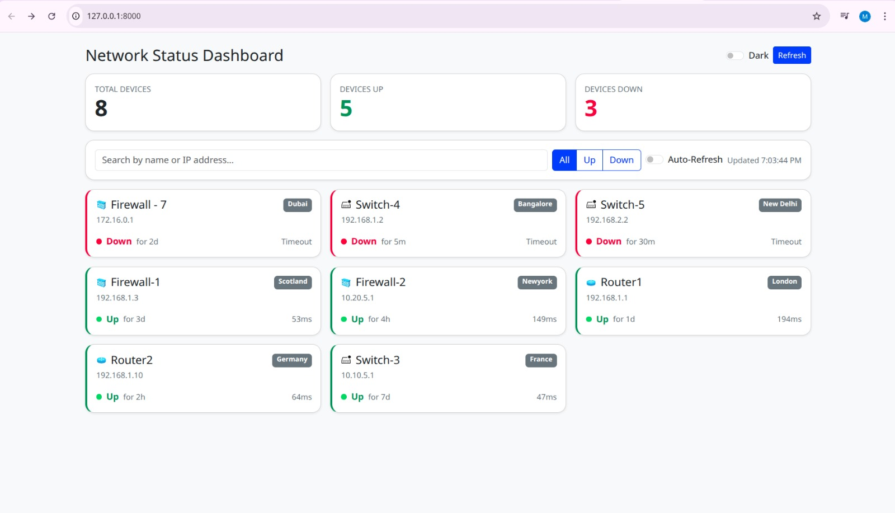

# Network Status Dashboard (Django)

A single-page Django application that shows a list of network devices, their status (Up/Down), and some extras like search, filters, a details modal, a mock “ping”.

The frontend uses Bootstrap 5 with a small amount of JavaScript.  
Everything runs locally, no external API calls are needed.



---

## Features

- Django single-page view (`/`) that loads data from a mock API at `/devices`
- Bootstrap UI with:
  - Search by name/IP
  - Up/Down filters
  - KPIs (total / up / down)
  - Device cards + details modal
  - Dark mode toggle
- Mock ping endpoint: `POST /devices/<id>/ping` (simulated RTT or timeout)
- Unit tests with `pytest` (positive and negative cases)
- Dockerfile to containerize the app
- Simple Kubernetes manifests (minikube friendly)

---

## 1. Local setup

The project uses a Python virtual environment (example on Ubuntu):

```bash
# clone the repo and cd into it
git clone https://github.com/jacobmarvel/NetworkDashboard.git
cd NetworkDashboard
#Create Virtual environment
python3 -m venv .venv
source .venv/bin/activate

pip install --upgrade pip
pip install -r requirements.txt
```
Run the Django dev server:
```
python manage.py runserver
# open http://127.0.0.1:8000
```

## 2. Running tests

Tests use pytest:
```
pytest -q
```
## 3. Docker

A simple Dockerfile is included to run the app in a container.

Build the image:
```
docker build -t <username>/networkdash:dev .
```

Run the container:
```
docker run -d --name netdash -p 8000:8000 <username>/networkdash:dev
docker container ls   # confirm the container is running
docker images         # see built images
```

If you want to push the image (optional):
```
docker push <username>/networkdash:dev
```
## 4. Kubernetes (minikube)

You can run the app on a local Kubernetes cluster using minikube.

Install minikube (example):
```

sudo install ./minikube-linux-amd64 /usr/local/bin/minikube
```

Start minikube:
```

minikube start
```


Load the local Docker image into minikube:
```

minikube image load <username>/networkdash:dev
```


Apply these:
```bash
kubectl apply -f networkdash.yaml
kubectl get svc
kubectl get pods
```


If you exposed the service as NodePort, you can open it with:
```
minikube service networkdash
```

## 5. Project structure

```bash
networkdash/
├─ manage.py
├─ requirements.txt
├─ pytest.ini
├─ Dockerfile
├─ networkdash.yaml           # Kubernetes 
├─ README.md
├─ networkdash/               # Django project package
│  ├─ __init__.py
│  ├─ settings.py
│  ├─ urls.py
│  ├─ wsgi.py
│  └─ asgi.py
└─ dashboard/                 # Main app
   ├─ __init__.py
   ├─ apps.py
   ├─ admin.py
   ├─ models.py               # (empty, as no DB needed
   ├─ services.py             # helpers for mock device data
   ├─ views.py                # index, /devices, /devices/<id>/ping
   ├─ urls.py
   ├─ templates/
   │  └─ dashboard/
   │     └─ index.html        # Bootstrap dashboard page
   ├─ static/
   │  └─ dashboard/
   │     ├─ app.js            # client-side logic 
   │     └─ icons/            # firewall.svg, router.svg, switch.svg, ...
   └─ tests/
      ├─ test_api.py
      ├─ test_services.py
      └─ test_views.py

```

